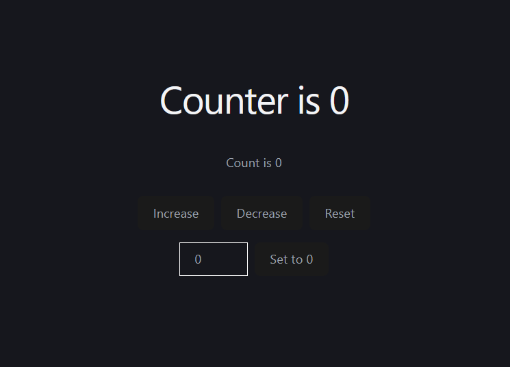

# 🔢 React Counter App

A simple yet interactive Counter Application built using React.js. This project demonstrates state management in React, allowing users to manipulate a central counter value through standard controls or a custom input field.

## 🚀 Features

- **Increment & Decrement:** Increase or decrease the counter value by 1 instantly.
- **Reset:** Instantly reset the counter back to `0`.
- **Custom Value Set:** Input a specific number and click the **"Set Count"** button to jump directly to that value.
- **Responsive Design:** Completely clean and mobile-friendly UI.

## 🛠️ Tech Stack

- **Frontend:** React.js (Functional Components, Hooks)
- **Styling:** CSS3