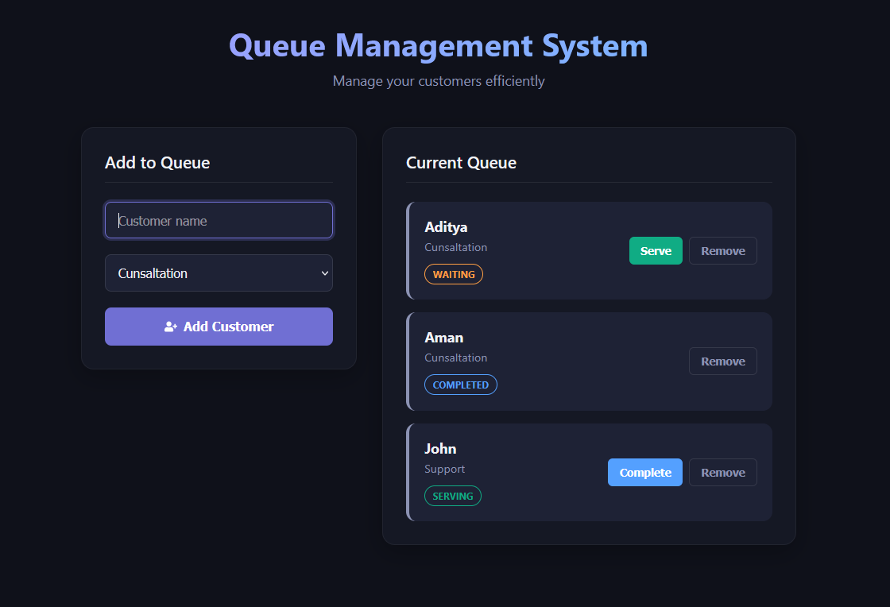

# ⏳ Queue Management System

A sleek, highly intuitive, and **modern dark-aesthetic web application** built with React to manage customer flows seamlessly. Track waiting times, serve ongoing clients, and log completed actions dynamically in real-time.

---

## 📷 Project Preview

Here is a glimpse of how the application looks with its rich dark mode design:

*Note: You can replace the image URL above with an actual screenshot of your running application once deployed or stored inside your repository.*

---

## ✨ Features

*   **⚡ Real-Time Operations:** Add customers to the queue with automatic time-based IDs and instantaneous screen updates.
*   **🎨 Premium Dark Aesthetic:** Crafted using deep custom slate grays, glowing accent borders, and clean typography.
*   **🏷️ Status Lifecycles:** Distinct micro-interactions and glowing status badges for different phases:
    *   `Waiting` (Vibrant Orange)
    *   `Serving` (Mint Green)
    *   `Completed` (Electric Blue)
*   **🎛️ Clean Control Flows:** Smart conditional button rendering ensures operators only see relevant actions (e.g., *Serve* vs. *Complete*).
*   **📱 Responsive Layout:** Grid architecture shifts gracefully from mobile screens to multi-column desktop monitors.

---

## 🛠️ Tech Stack & Dependencies

*   **Frontend Library:** React (Functional Components + Hooks)
*   **State Management:** `useState` hook for clean, local structural states.
*   **Styling:** Native CSS Custom Properties (Variables) & Responsive Flexbox/Grid systems.
*   **Icons Package:** `react-icons/fa` for structural form indicators.

---