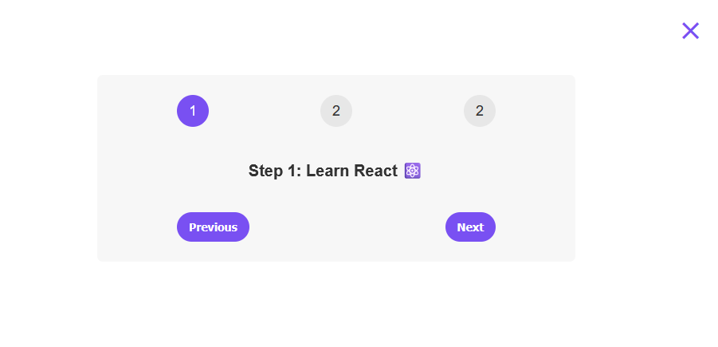

# Steps UI

A simple multi-step progress component built with React.

## Preview



## Features

- Multi-step progress indicator
- Previous & Next navigation
- Responsive design

## Tech Stack

- React
- CSS

## Getting Started

This repository contains multiple React projects.

To run the **Steps** project:

```bash
# Clone the repository
git clone https://github.com/taha-javed-dev/react-learning-journey

# Navigate to the project folder
cd react-learning-journey/05-steps

# Install dependencies
npm install

# Start the development server
npm run dev
```

## Note

This project is a frontend UI demonstration only and does not include backend functionality.
